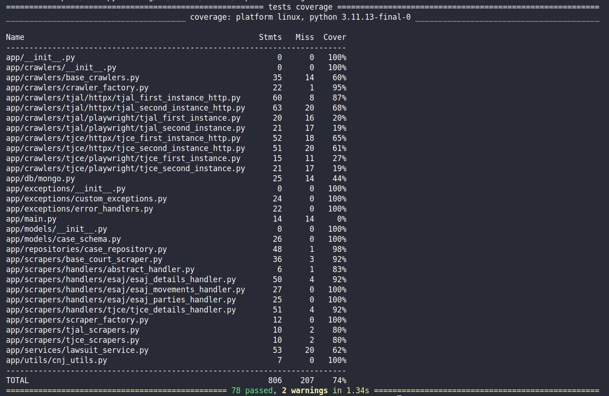

# Challenge 01 - Data Collection  

  
  
  
  
  

---

## Descrição  

Este projeto foi desenvolvido no contexto do **Challenge 01 - Data Collection**, com o objetivo de criar "uma API para a busca e armazenamento de dados
processuais de todos os graus dos Tribunais de Justiça de Alagoas (TJAL) e do Ceará (TJCE). A arquitetura da solução contemplará a busca em todas as instâncias judiciais (graus), consolidando as
informações em um banco de dados não-relacional."

---

## Arquitetura Geral  

### Estrutura de Diretórios  

```
app/
 ├── controllers/        # Camada de entrada (endpoints)
 ├── crawlers/           # Crawlers HTTPX e Playwright
 ├── scrpers/           # Scrapers + Handlers de extração
 ├── models/             # Schemas Pydantic (Case, Party, Movement)
 ├── repositories/       # Persistência em MongoDB
 ├── services/           # Orquestração (crawler + scraper + persistência)
 ├── db/                 # Conexão e inicialização do banco (Mongo)
 ├── utils/              # Funções utilitárias
 ├── exceptions/         # Exceções customizadas
 └── main.py             # Ponto de entrada
tests/
 ├── 'mesma estrutura acima' # Testes unitários
 └── fixtures/           # HTMLs de teste

```


### Arquitetura em Camadas  

A arquitetura segue o padrão de camadas, com classes bem definidas para cada responsabilidade: service, crawlers, controller, modal, service... Essa abordagem promove a separação de responsabilidades entre as classes, tornando o código mais organizado e fácil de manter.

| Camada        | Responsabilidade                                                                 |
|---------------|----------------------------------------------------------------------------------|
| **Controller**| Camada de entrada da aplicação (ex.: FastAPI endpoints).                         |
| **Crawler**   | Buscar HTML (via HTTPX ou Playwright).                                          |
| **Scraper**   | Extrair dados do HTML e transformá-los em objetos `Case`.                      |
| **Factory**   | Selecionar dinamicamente crawler/scraper (Strategy Pattern).                   |
| **Service**   | Orquestrar coleta + scraping + persistência.                                   |
| **Repository**| Persistência no MongoDB.                                                       |
| **Models**    | Estrutura dos dados em Pydantic.                                               |
| **DB**        | Configuração e inicialização da conexão com MongoDB.                           |


### Fluxo de uma Requisição  
0. A aplicação é iniciada no main.py, que cria as variáveis globais e configura o MongoDB
1. Usuário informa o **número do processo (CNJ)**.  
2. A requisição chega à camada **Controlle** que irá receber todas as requisições do usuário e direcioná-las para as partes corretas da aplicação.  
2. O **Service** detecta tribunal e instância.  
3. O **CrawlerFactory** seleciona o crawler apropriado.  
4. O crawler retorna o **HTML bruto**.  
5. O **ScraperFactory** seleciona o scraper correto.  
6. O Scraper aplica os **handlers** para extrair os dados (detalhes, partes, movimentações).  
7. O objeto `Case` é construído.  
8. O **Repository** salva no MongoDB.  
9. O resultado JSON é retornado ao usuário.  

---

## Escalabilidade e Princípios SOLID  

- **Open/Closed Principle**: novos tribunais podem ser adicionados sem modificar código existente.  
- **Strategy Pattern**: seleção dinâmica de crawler/scraper via Factory.  
- **Classes Abstratas**:  
  - `BaseCourtCrawler` (contrato comum com retry).  
  - `BaseHttpCrawler` (HTTPX).  
  - `BaseBrowserCrawler` (Playwright).  
  - `BaseCourtScraper` (Scraping com BeautifulSoup + Handlers).  


### Adicionando um Novo Tribunal  

A arquitetura do sitema foi projetada para facilitar a inclusão de novos tribunais, mantendo a consistência e o cumprimento do contrato definido (JSON).  
O processo segue três etapas principais:

1. **Criar um Crawler**  
   - Se o tribunal exige navegação em páginas (ex.: Playwright), implemente a classe abstrata `BaseBrowserCrawler`.  
   - Se o tribunal permite acesso direto via requisições HTTP, utilize a `BaseHttpCrawler`.  
   - Ambos herdam de `BaseCourtCrawler`, que exige a implementação do método `run()` e aplica a política de **retry com exponential backoff** (@retry).  

   Exemplo (Tribunal de Justiça de Sergipe):  
   ```python
   class TJSEFirstInstanceHttpCrawler(BaseHttpCrawler):
       ...

2. **Criar um Scraper**  

  - O scraper deve herdar de BaseCourtScraper, que garante validações universais e aplica o contrato JSON.

  - Cada campo do contrato (detalhes, movimentações e partes) é extraído por handlers específicos.

  - Para tribunais que usam E-SAJ, basta reaproveitar os handlers existentes em /handlers/esaj.

  - Para casos específicos, crie um diretório dedicado ao tribunal e implemente handlers customizados (como o que acontece em /handlers/tjce).

    Exemplo (TJSE - 1ª instância):
    ```python
    class TJSEFirstInstanceScraper(BaseCourtScraper):
        def __init__(self):
            super().__init__(
                tribunal="TJSE",
                instancia=1,
                handlers=[ESAJDetailsHandler(), TJSEPartiesHandler(), TJSEMovementsHandler()]
            )

3. **Registrar nas Factories**

  - Por fim, adicione o novo Crawler e Scraper nas respectivas Factories (CrawlerFactory e ScraperFactory), permitindo que o sistema os selecione dinamicamente de acordo com o tribunal e a instância. 
  
  Com essa estrutura, a adição de novos tribunais torna-se previsível e escalável.

---

### Robustez e Tratamento de Erros

O sistema foi projetado para ser resiliente e lidar bem com falhas. Isso foi alcançado por meio de quatro estratégias principais:

1. **Exceções customizadas e descritivas**  
   Implementamos exceções customizadas e com mensagens claras, como a `CrawlerTimeoutException`, usada para lidar com falhas de rede e timeouts.  

2. **Sistema de fallback**  
   Inicialmente, os crawlers foram implementados apenas com `BaseBrowserCrawler` (Playwright). Contudo, devido à lentidão e instabilidade desse método, criamos também crawlers baseados em `BaseHttpCrawler` (HTTPX).  
   Assim, quando um crawler HTTPX falha, o sistema automaticamente tenta novamente com Playwright como segunda opção. Isso permite resiliência ao sistema. 

3. **Retry com exponential backoff**  
   A classe base de todos os crawlers, `BaseCourtCrawler`, implementa o decorador `@retry`, que repete a operação em caso de falha, aguardando intervalos progressivamente maiores entre as tentativas.  
   Isso aumenta as chances de sucesso quando a falha é causada por sobrecarga temporária do servidor do tribunal ou problemas de conexão. 

4. **Isolamento de mudanças no HTML**  
   Cada parte do processo (detalhes, partes e movimentações) é extraída por *handlers* independentes. Se o layout de um tribunal mudar, basta corrigir o handler correspondente — por exemplo, `PartiesHandler` — sem impactar o restante do sistema.  

---

## Convenções adotadas

Durante a raspagem de dados, pbservei que alguns campos dos sites dos tribunais não correspondiam exatamente ao contrato definido no JSON de saída, principalmente no que diz respeito a certas profissões/ofícios que não estavam previstos no modelo.  

Diante disso, avaliamos duas opções:  
1. Adicionar novos ofícios ao JSON.  
2. Mapear essas profissões para categorias já existentes, de forma padronizada.  

Optamos pela segunda abordagem, mantendo a consistência com o contrato já estabelecido para o desafio. Além disso, como a próxima etapa do pipeline envolve o tratamento e enriquecimento dos dados brutos, qualquer estruturação prematura poderia gerar inconsistências e dificultar esse processo.  

As principais convenções adotadas foram:  
- **"Relator(a)"** → mapeado como **"Juiz"**.  
- **"Defensor Púb."** e **"Promotor(a)"** → mapeados como **"Advogado"**.  
- O atributo **"Movimentações"** foi mantido como dado bruto, para ser tratado e refinado na etapa de enriquecimento.  

---

## Testes  

Foram construídos aproximadaente 78 testes unitários na API, cobrindo as principais funcionalidades e casos de borda da aplicação. Os testes foram projetados para garantir o cumprimento dos requisitos do sistema.

- Alguns dos cenários cobertos:  
  - Processo inexistente.  
  - Parser dos dados correatamente. 
  - Sistema de cache com o Banco.  
  - Processo válido com partes e movimentações.  
  - Sistema de exceções  
- Cobertura atingida: **74%**.  


---

## Execução  

### Preparação
É necessário estar logado no DockerHub para realizar o download da imagem do MongoDB:  
```bash
docker login <username>
```

### Subir a aplicação

Para subir os containers (aplicação + banco de dados):

```bash
docker compose up -d --build
```

### Rodar os testes
```bash

pytest
```
### Rodar os testes com cobertura
```bash
pytest --cov=app --cov-report=term-missing
```
---