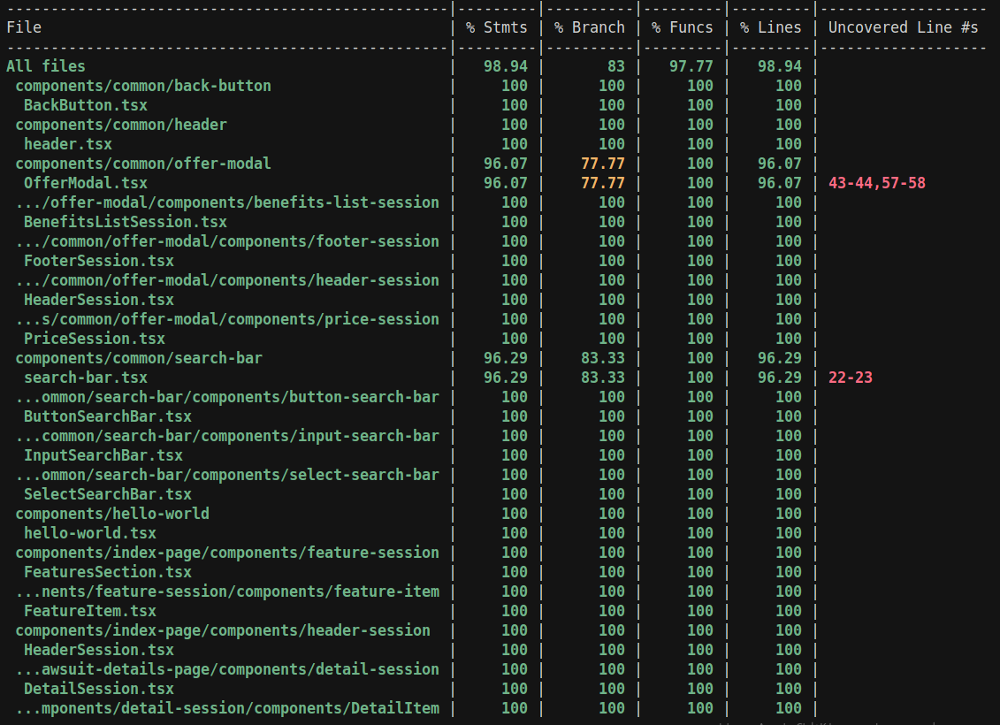

# Frontend

## 1. Descrição

O Frontend oferece uma interface para consulta e busca de processos judiciais. Oferece as seguintes funcionalidades:

- **Busca por CNJ**: Permite buscar processos por número CNJ, com suporte para formato com máscara ou sem máscara 
- **Filtragem por tribunal**: Permite filtrar processos por tribunal (TJAL, TJCE ou Todos)
- **Página de desambiguação**: Exibe resultados de busca quando múltiplos processos são encontrados
- **Página de detalhes**: Exibe informações completas do processo, incluindo movimentações, partes envolvidas e detalhes do processo
- **Experimentos**: Implementa sistema de experimentação para bloqueio de movimentações 

## 2. Arquitetura e Estrutura do Repositório

A arquitetura segue o padrão Atomic Design (citado pelo Thiago Stival em uma mentoria). Para facilitar a organização, os componentes foram divididos por features/páginas, onde cada página possui seus componentes específicos em `/components/nome-da-pagina/`.

Como seguimos o Atomic Design, componentes maiores (organismos/moléculas) importam componentes menores (átomos). Portanto, temos a estrutura `/components/nome-da-pagina/components-moleculas/components-atomos`.

Além disso, foram criados três diretórios adicionais para centralizar funcionalidades:

- **`/types`**: Centraliza todos os tipos e interfaces utilizados no frontend, incluindo tipos de modais e contratos com o backend
- **`/graphql`**: Centraliza todas as requisições GraphQL a serem feitas ao backend
- **`/hooks`**: Centraliza lógicas de acesso às informações do experimento e modal de oferta

## 3. Fluxo de Busca

O fluxo de busca segue os seguintes passos:

1. **Página inicial (`/index`)**: O usuário entra na página inicial e faz uma consulta na barra de pesquisa, informando o número CNJ e/ou selecionando um filtro por tribunal.

2. **Página de desambiguação (`/search-results`)**: A pesquisa (com o número CNJ e/ou o filtro por tribunal) redireciona para a página de desambiguação, que exibe todos os processos encontrados.

3. **Página de detalhes (`/lawsuit/[cnjNumber]`)**: O usuário escolhe o processo que deseja visualizar e é redirecionado para a página de detalhes, que exibe informações completas do processo.

4. **Experimento**: Na página de detalhes, é feita uma chamada GraphQL para verificar se o usuário faz parte do experimento. Um usuário é considerado escolhido para o experimento quando, ao realizar a requisição GraphQL, o retorno contém `alternative = "variant-a"` e `participating = true`. Nesse caso, o experimento do modal está ativo (uma flag é acionada), a última movimentação é bloqueada e o usuário tem a possibilidade de abrir um modal de oferta para assinatura.

   Atualmente, faço uma requisição GraphQL sem os parâmetros `alternative` e `simulating` sempre que a página é carregada — ou seja, o sorteio fica a cargo da API de experimentação. Isso faz com que seja necessário atualizar a página várias vezes até que o experimento ocorra.

5. **Registro de Interação**: Se o usuário interagir com o modal (abrir, assinar, fechar), é feita uma requisição a uma mutation GraphQL (`registerLastInteractionMutation`) para alterar a data de interação daquela movimentação específica.

## 4. Decisões de Projeto

### 4.1 Design e UX

Busquei seguir o design atual disponível em [https://www.jusbrasil.com.br/consulta-processual/](https://www.jusbrasil.com.br/consulta-processual/). Com a dica do Thiago Stival de usar o Radix UI, isso acabou sendo facilitado, pois segue o padrão que econtramos no site da Jus.

O projeto foi pensado totalmente para ser responsivo, garantindo uma experiência adequada em diferentes tamanhos de tela. 

### 4.2 Front-end "burro"

Toda lógica envolvendo o input do usuário, como validações e normalizações, foram endereçadas ao backend, que retorna mensagens de erro apropriadas. O frontend apenas exibe essas mensagens ao usuário, mantendo a lógica de negócio no backend.

## 5. Testes

Realizamos diversos testes utilizando React Testing Library, Jest e jest-dom, seguindo as práticas ensinadas pela Bianka Vasconcelos em sua mentoria.

### Estratégia de Testes

- **Componentes atômicos (átomos)**: Cada componente individual foi testado isoladamente, garantindo que funcione corretamente em si mesmo.
- **Componentes compostos (moléculas/organismos)**: Componentes que dependem de átomos foram testados mockando esses átomos (já testados individualmente).

### Resultados dos Testes


### Cobertura de Testes



### Como executar os testes

**Executar todos os testes:**
```bash
cd frontend-boilerplate 
pnpm test
```

**Executar testes com cobertura:**
```bash
cd frontend-boilerplate
pnpm test:coverage
```
