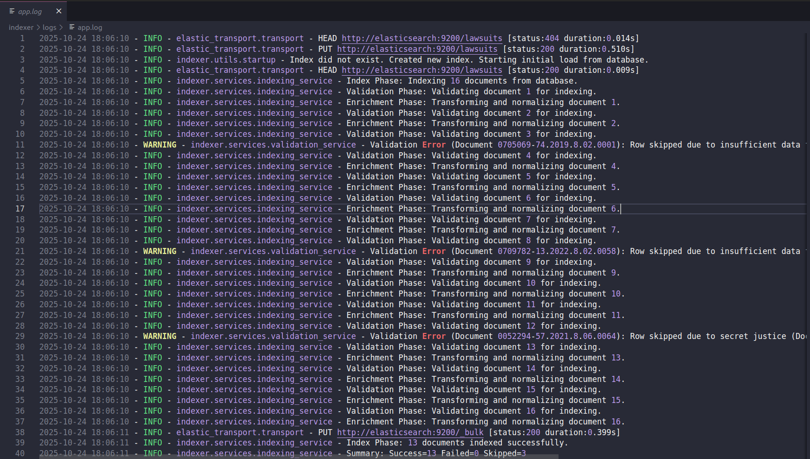
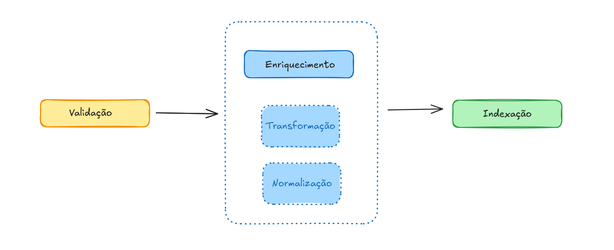

# Indexer

  
  
  
  

Este repositório contém o **Indexer**, uma API REST responsável por indexar documentos de processos judiciais no Elasticsearch, permitindo buscas via o módulo Searcher.

---

## 1. Descrição

O Indexer oferece funcionalidades de validação, enriquecimento e indexação de processos. Oferece endpoints REST para:  

- Indexação de um único documento  (`POST /index/document`)
- Indexação de múltiplos documentos  (`POST /index/documents`)
- Indexação de todos os documentos existentes no banco (`POST /index/db`) 
- Deleção de documentos por ID  (`DELETE /index/document/{id}`)  

---

## 2. Arquitetura adotada e estrutura do repositório

A arquitetura segue o padrão de **camadas**, separando responsabilidades entre **controllers**, **services**, **models** e **repository**. Isso promove maior organização e manutenção mais fácil.  

- **Controllers:** endpoints da API  
- **Services:** lógica de validação, enriquecimento e indexação  
- **Models:** Pydantic para validação e tipagem  
- **Utils:** funções auxiliares, logging e integração com Elasticsearch  

Exemplo da estrutura de diretórios:

```
indexer/
 ├── main.py                 # Ponto de entrada da API
 ├── controllers/
 │    └── index_controller.py
 ├── services/
 │    ├── indexing_service.py
 │    └── validation_service.py
 │    └── normalization.py
 │    └── enrichment_service.py
 ├── models/
 │    ├── api_models.py
 │    ├── es_models.py
 │    ├── kb_models.py
 ├── utils/
 |── repository/
 │    └── db_repository.py
 │    └── es_repository.py
 ├── tests/
 │    ├── controllers/
 │    ├── services/
 │    └── utils/
 └── pyproject.toml
```

**Logging:** foi implementado um sistema de log em todas as camadas para facilitar depuração. Para acessar, basta ir em /logs 



**Validação de dados:** Pydantic garante que todos os documentos indexados respeitem os schemas esperados, com mensagens de erro claras quando campos obrigatórios estão ausentes (com exceções feitas devido ao problema com o DB).

---

## 3. Fluxo de Indexação

O pipeline de indexação segue o fluxo sugerido durante as mentorias (dada por Jack):

1. **Validação:**  
   Garantimos que todos os campos obrigatórios do Pydantic estejam presentes e preenchidos.  

2. **Enriquecimento:**  
   Transformação dos dados para o payload aceito pelo Elasticsearch e normalização de campos. Como os dados são provenientes de KB, as normalizações foram simplificadas, porém, a princípio, deveriam ser robostas para garantir maior segurança ao processo de indexação.   

3. **Indexação:**  
   Documentos validados e enriquecidos são enviados ao Elasticsearch para indexação.


---

## 4. Decisões de Projeto

- **API REST em vez de serviço:**  
  Optamos por criar uma API REST com endpoints distintos em vez de um serviço de carregamento apenas. Isso permite integração futura com outros módulos (como Searcher) e se aproxima de um ambiente de produção real (visando o projeto final do mini-jus).  

- **Otimização dos analyzers:**  
  Mantivemos os analyzers sugeridos e adicionamos:  
  - **Stop words**: palavras de baixo valor semântico são ignoradas  
  - **Stemmer (minimal_portuguese)**: permite buscar pela raiz da palavra, o que permitiria consultadas como "danos" e "dado"  
  - **Lowercase** e **remoção de acentuação**  

- **Flexibilização das validações e tratativa de erros:**  
  Devido à inconsistência nos dados, algumas validações Pydantic foram flexibilizadas para permitir indexação parcial. Assim que o banco de dados estiver corrigido, as validações seguirão integralmente as regras definidas no desafio.

---

## 5. Melhorias Futuras

1. **Implementar sistema de CI/CD**
   - Automatizar testes e validação de schemas.

2. **Tratamento robusto de exceções**
   - Atualmente, erros inesperados podem causar falhas abruptas.  
     Planejo construir uma camada específica para o tratamento de exceções, visando padronizar respostas de erro e mensagens ao usuário.

3. **Sistema de métricas**
   - Incluir ferramentas discutidas durante a semana sobre observabilidade, como Phrometeus e Grafana. 

4. **Desenvolvimento de um conjunto de dados robusto de processos judiciais**
   - Desenvolver um banco de dados com processos judiciais devidamente enriquecido pela etapa de KB. 
---

## 6. Testes

Foram implementados **testes unitários** para cada camada da aplicação, incluindo **edge cases**:

- **Controllers:** validação de payload, status codes e erros HTTP  
- **Services:** validação e enriquecimento de documentos, indexação e deleção  
- **Utils:** funções auxiliares, conexão com Elasticsearch, logging  

- Para rodar os testes:

```bash
cd indexer 
pytest -v ./tests
```

---

## 7. Endpoints disponíveis:  

- `POST /index/db` → indexa todos os documentos do banco  
- `POST /index/document` → indexa um documento individual  
- `POST /index/documents` → indexa múltiplos documentos  
- `DELETE /index/document/{doc_id}` → deleta documento por ID

