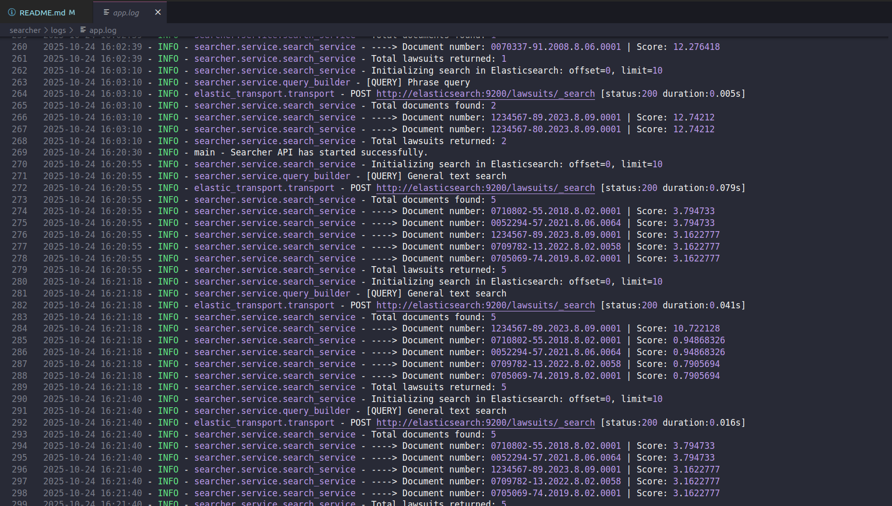

# Searcher

  
  
  
  
  


Este repositório contém o **Searcher**, uma aplicação responsável por **receber requisições de busca**, interpretar a intenção do usuário, construir uma *query* estruturada no Elasticsearch e retornar os resultados.

---

## 1. Descrição

O **Searcher** é responsável por toda a lógica de consulta ao índice de processos.  
A aplicação foi construída em **FastAPI**, e serve como interface HTTP entre o cliente e o Elasticsearch.  

---

## 2. Arquitetura adotada e estrutura do repositório

A arquitetura segue o padrão de camadas, com classes bem definidas para cada responsabildade. Essa abordagem promove a separação de responsabilidades entre as classes, tornando o código mais organizado e fácil de manter.

As camadas principais são:

- **controllers/** → define os endpoints
- **services/** → contém a lógica de negócio e montagem das queries  
- **models/** → define os esquemas Pydantic (request e response)  
- **utils/** → funções auxiliares (regex, logging, formatação, etc.)  
- **main.py** → ponto de entrada da aplicação   

```
searcher/
 ├── main.py                    # Ponto de entrada da aplicação
 ├── config/                     
 │   └── seetings.py            # Armazenamento de variáveis globais e de configuração
 ├── controllers/
 │   └── search_controller.py   # Define as rotas e o fluxo de requisição
 ├── services/
 │   └── query_builder.py       # Identificação da intenção de busca e construção de queries
 │   └── search_service.py      # Contém a lógica de construção da query e chamada ao Elasticsearch
 ├── models/
 │   ├── request_model.py       # Modelos Pydantic para validação de entrada
 │   └── response_model.py      # Modelos Pydantic para validação de saída
 ├── utils/
 │   ├── elastic_connection.py  # Cliente de conexão ao Elasticsearch
 │   ├── regex_utils.py         # Identificação de intenções de busca
 │   └── logger.py              # Sistema de logs estruturados
 ├── test/                      # Testes unitários
 ├── requirements.txt / pyproject.toml
 └── README.md
```
- Log semântico:
   - Foi implementado um sistema de logging semântico e padronizado em toda a aplicação, com mensagens estruturadas.Vocês podem ver o log em /logs.



---

## 3. Fluxo de busca

A seguir, o fluxo típico de uma requisição de busca dentro do Searcher:

1. **Requisição recebida**
   - O endpoint `/search` recebe o payload JSON via HTTP POST.

2. **Validação**
   - O Pydantic valida campos obrigatórios e tipos.
   - Caso o formato seja inválido, retornamos `422 Unprocessable Entity`.

3. **Identificação da intenção de busca**
   - Um regex analisa o conteúdo da consulta e identifica qual dos 3 tipos é a consulta:
     - é um **número CNJ** ,
     - é uma **phrase query**,
     - ou uma **busca textual genérica**.

4. **Construção da query**
   - A query é montada no `search_service` (mais especificamente no `build_query`), com base na intenção detectada.

5. **Execução no Elasticsearch**
   - O serviço envia a query via cliente HTTP, e o Elasticsearch retorna os documentos correspondentes.

6. **Formatação e validação da resposta**
   - Os resultados são validados pelo modelo `ResponseModel` (Pydantic), e o conteúdo de cada campo é enriquecido com *highlighting*.

7. **Retorno ao usuário**
   - O JSON final é retornado pela API, já padronizado e valdado.

---

## 4. Decisões de Projeto

### Estratégia de Busca (Recall + Precision)
Optei por uma **combinação** de dois *multi_match queries*:
- O primeiro garante **recall**, trazendo resultados parcialmente compatíveis.
- O segundo garante **precisão**, enfatizando frases próximas por meio de *slop*. Se encontradas, nós recompensamos o sistema de raking com um *boost*.

Créditos: Essa abordagem foi originalmente compartilhada pela colega Luiza Gontijo no canal do Slack.

### Highlighting
Implementei o *highlighting* nativo do Elasticsearch (inicialmnte extra).

### Validação Flexível (dados incompletos)
Como descrito no Readme do repositório, durante o desenvolvimento das aplicações enfrentei problemas com a inconsistência nos dados que seriam indexados (com campos ausentes ou nulos).  
Por isso, algumas validações Pydantic foram flexibilizadas para permitir respostas parciais — garantindo funcionalidade mesmo com dados incompletos.  

Assim que o database for corrigido, as validações voltarão a seguir integralmente as regras definidas na descrição do desafio.

---

## 5. Melhorias Futuras

1. **Implementar sistema de CI/CD**
   - Automatizar testes e validação de schemas.

2. **Tratamento robusto de exceções**
   - Atualmente, erros inesperados podem causar falhas abruptas.  
     Planejo construir uma camada específica para o tratamento de exceções, visando padronizar respostas de erro e mensagens ao usuário.

3. **Sistema de métricas**
   - Incluir ferramentas discutidas durante a semana sobre observabilidade, como Phrometeus e Grafana. 

4. **Desenvolvimento de um conjunto de dados robusto de processos judiciais**
   - Desenvolver um banco de dados com processos judiciais devidamente enriquecido pela etapa de KB. 
---

## 6. Testes

Foram implementados testes unitários para cada camada da aplicação. Os testes incluem:

Controllers: validação de payloads e tratamento de exceções.

Services / Query Builder: construção correta de queries

- Para rodar os testes:

```bash
cd searcher 
pytest -v ./tests
```

---